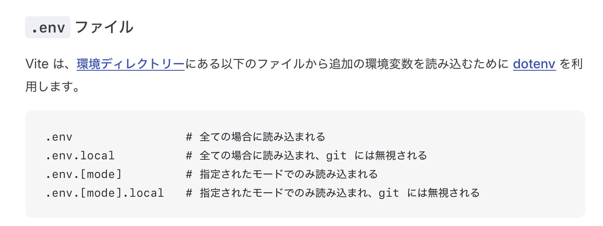

### Vite で環境変数を扱う方法

- ★Vite は dotenv ビルドインで内蔵している

#### 利用方法

1. env ファイルを作成する

    

    引用: [Vite - .env ファイル](https://ja.vite.dev/guide/env-and-mode#env-files)

<br>

2. env ファイル中で **VITE_ から始まる変数名** で環境変数を定義する

    ```
    #.env
    VITE_MY_KEY="This is my key"
    ANOTHER_KEY=111 #これは無効
    ```

<br>

3. クライアントソースコード (=ブラウザで実行されるコード) にて、`import.meta.env.[envファイルで定義した変数名]` でアクセスすることができる

    ```jsx
    //App.js
    function App() {
        return (
            <>
                <h1>Hello World</h1>
                { 
                    console.log(import.meta.env.VITE_MY_KEY); //"This is my key"
                    console.log(import.meta.env.ANOTHER_KEY); //undefined
                } 
            </>
        );
    }

    export default App
    ```

    <br>

    *クライアントソースコードとは、React でいうコンポーネントファイルや HTML に埋め込まれたスクリプト/スクリプトファイル

    <br>

    *逆にサーバーサイドのソースコードとは以下の通り

    

<br>
<br>

参考サイト

[Vite - 環境変数](https://ja.vite.dev/guide/env-and-mode#env-variables)


