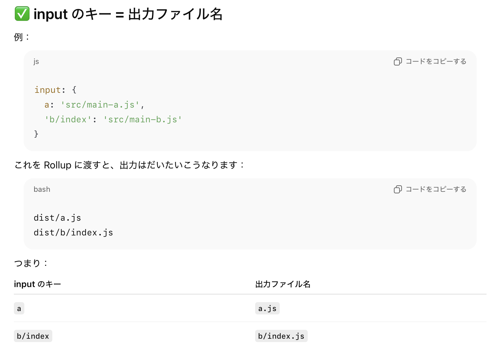

### vite.config.js

- Vite の設定ファイル

<br>

- ビルドの挙動のカスタマイズや環境変数の設定、 Vite で利用するプラグインの指定などができる

<br>

- ファイル名は vite.config.js (.ts)

    - vite コマンドでビルドする際に　`--config` オプションを利用することで、任意のファイルを config ファイルとして指定できる

        ```bash
        vite --config ./my-config.js
        ```

<br>

#### vite.config の書き方の基礎

- オブジェクトを export する

    ```js
    //↓JSDocコメント
    /** @type {import('vite').UserConfig} */

    export default {
        //設定
    }
    ```

<br>

- `defineConfig` モジュールを export すると JSDoc コメントがなくても、IDE 上でのサポートが利用可能になる

    ```js
    import { defineConfig } from 'vite'

    export default defineConfig({
        //設定
    });
    ```

<br>
<br>

参考サイト

[Configuring Vite](https://vite.dev/config/)

[ビルドのカスタマイズ](https://ja.vite.dev/guide/build#ビルドのカスタマイズ)

---

### プラグインの指定

- 利用したいプラグイン (モジュール) を config ファイルに import する

<br>

- plugins フィールド (配列) を定義し、その要素としてプラグインを指定


    ```js
    /** @type {import('vite').UserConfig} */
    import tailwindcss from '@tailwindcss/vite'

    export default {
        plugins: [
            tailwindcss(), //関数呼び出しで指定
        ]
    }
    ```

<br>

- プラグインの実行順を指定したり、実行の条件を指定する場合は以下のようにプラグインを指定する必要がある

    ```js
    /** @type {import('vite').UserConfig} */
    import tailwindcss from '@tailwindcss/vite'

    export default {
        plugins: [
            {//オブジェクトで渡す
                ...tailwindcss(), //★スプレッド構文で展開
                enforce: "pre", //実行順の指定
                apply: "server" //実行条件の指定
            }
        ]
    }
    ```

<br>

### なぜプラグインの渡し方が複数あるのか?


<br>
<br>

参考サイト

[プラグインの使用](https://ja.vite.dev/guide/using-plugins)

[How To Build And Use Plugins In Vite](https://blog.openreplay.com/build-use-plugins-vite/?utm_source=chatgpt.com)

[Rollup - Plugin Development](https://rollupjs.org/plugin-development/)

---

###  ビルドのエントリーポイント

- デフォルトのビルドエントリーポイントはプロジェクトルート直下の index.html

- build.rollupOptions.input にビルドのエントリーポイントとなるファイルを指定する

    ```js
    //vite.config.js
    import { defineConfig } from 'vite'

    export default defineConfig({
        build: {
            rollupOptions: {
                input: {
                    //key: "file path" で指定する
                    entry: "src/main.ts"
                }
            },
        },
    });
    ```

    <br>

    - input オブジェクトで指定するキー (上記の例で言うと `entry`)　は出力されるファイルの名前に相当する

        

<br>
<br>

参考サイト

[Vite - ビルドのカスタマイズ](https://ja.vite.dev/guide/build#ビルドのカスタマイズ)

[Rollup - input](https://rollupjs.org/configuration-options/#input)