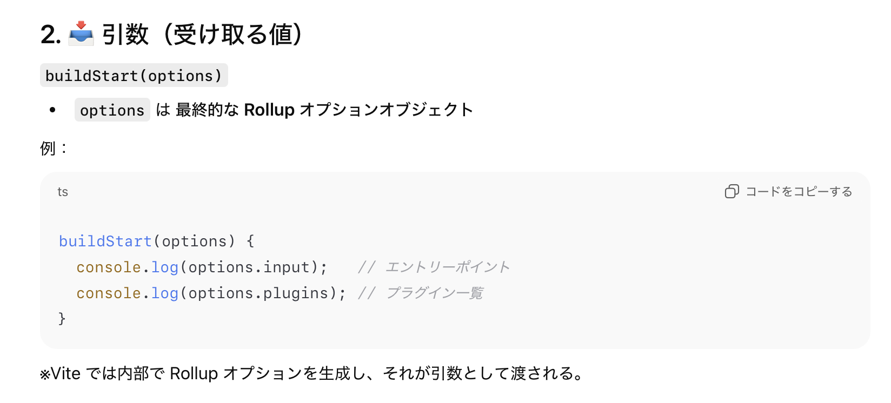
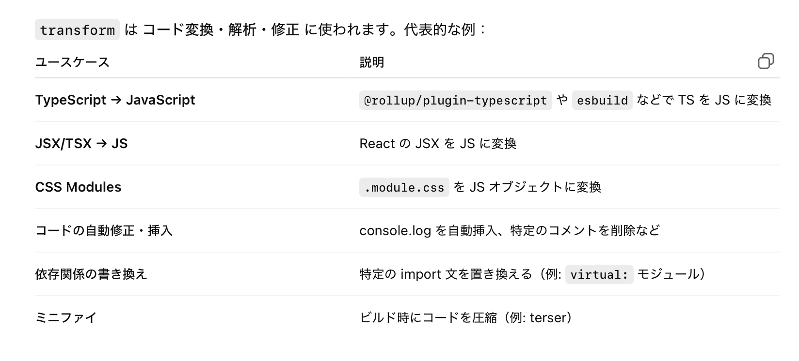
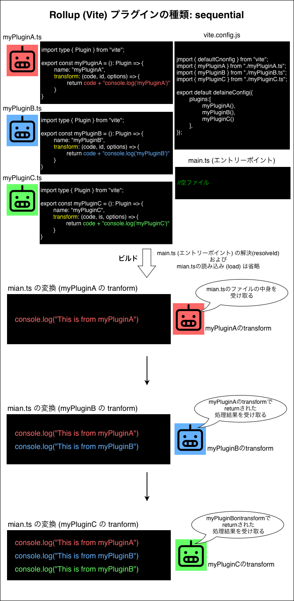
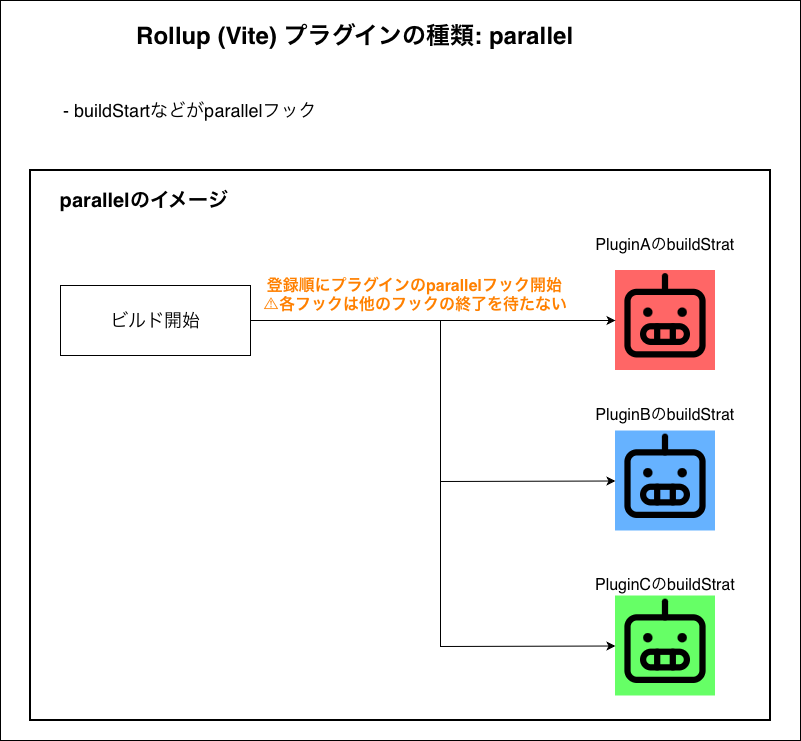
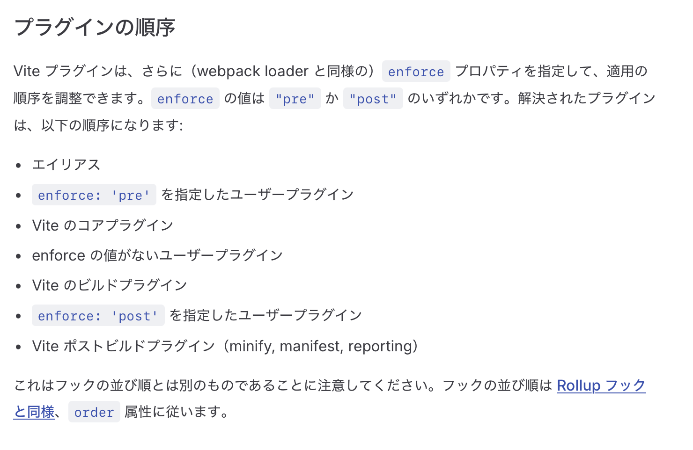
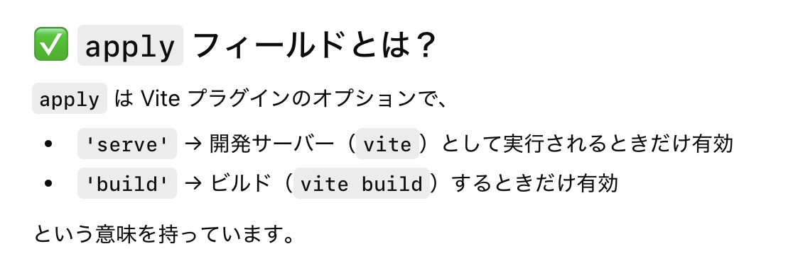
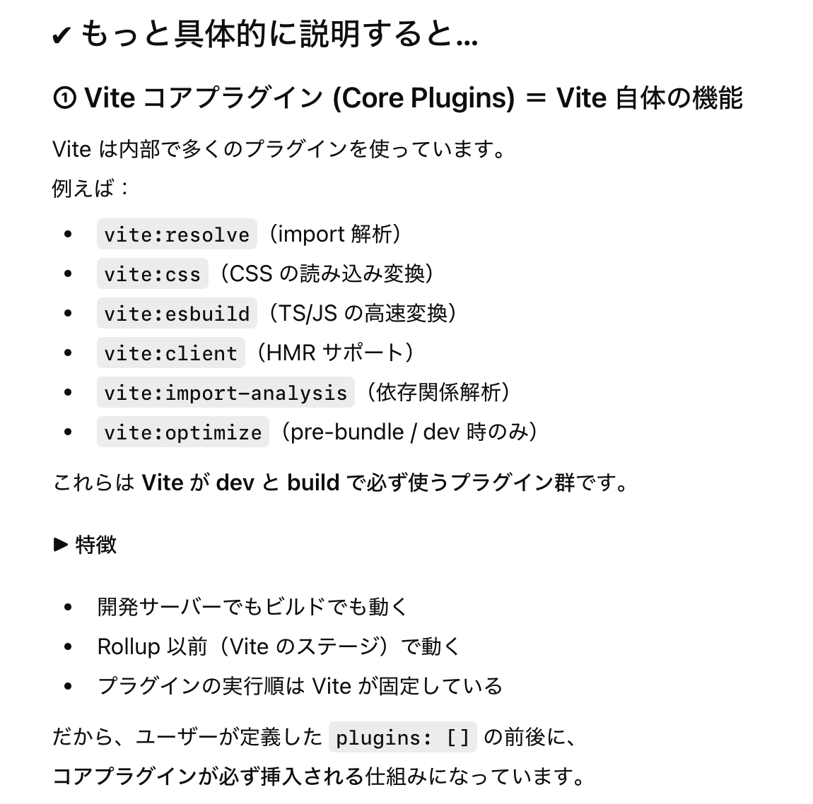
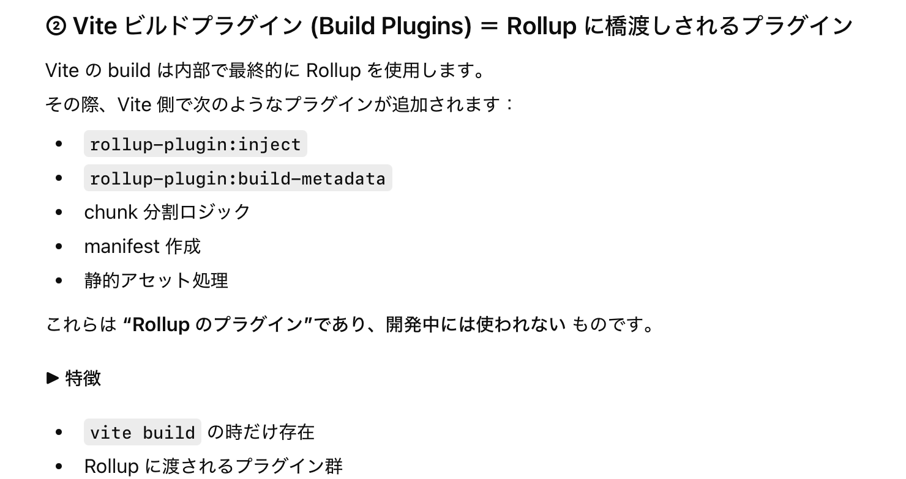

### Vite のプラグイン

- 実態は特定のプロパティを持ったオブジェクトを返す関数

    - [Rollup プラグイン](https://rollupjs.org/plugin-development/) を拡張した形

<br>
<br>

参考サイト

[Plugin API](https://vite.dev/guide/api-plugin?utm_source=chatgpt.com)

---

### Vite プラグイン (Rollup プラグイン) が返すオブジェクト

```js
const myPlugin = () => {
    name: "my-plugin",
    transform: (code, id) => { //hooks関数の1つであるtransform
    },
    resolveId: (source) => { //hooks関数の1つであるresolveId
    }
};

export default myPlugin;
```

<br>

- ★プラグイン (関数) が返すオブジェクは name プロパティと、少なくとも1つの hoooks プロパティを持つ必要がある

    - `name プロパティ (String)`

        - プラグインにつける一意の名前

        - エラーメッセージでどこのプラグインで発生したエラーかを表示される際に必要
        
        - Vite では実行順の調整にも name プロパティが参照されるらしい

    <br>

    - `hooks プロパティ (function)`

        - ライフサイクルに応じた関数

        - ★関数名は決まっている

        - モバイルアプリ開発のフレームワークでよく見る `onCreate`、`onDestory` みたいなイメージ

<br>

#### hooks の書き方

- オブジェクトの関数プロパティの書き方はいくつか種類がある

    ```js
    const obj = {
        resolveId: () => {}, //アローを記述
        resolveId: function() {}, //無名関数を記述
        resolveId() {} //(ES6から)名前付き関数をそのまま記述すると、その関数名がプロパティ名になる
    }
    ```

---

### 代表的な hooks (Vite プラグイン, Rollup プラグインで共通)

- Vite プラグインは Rollup プラグインを拡張したものなので、**Rollup プラグインで使える hooks は Vite プラグインでも利用可能**

<br>

- ★vite コマンドで開発サーバーを起動する場合は、いくつかの hooks のトリガーのタイミングが異なる

    - Rollup は純粋なモジュールバンドラー (サーバー機能は無い)
    
    <br>

    - ★★一方、Vite は開発サーバーでのビルドは esbuild、本番ビルド (静的ビルド) では Rollup を内部で利用している

        - 従って Vite では開発サーバーでのビルドと本番ビルドの仕組みが異なり、開発サーバー (esbuild )でのビルドの際は hooks のトリガーのタイミングが 本番ビルド (Rollup でのビルド) とは異なる

    <br>

    - ★★★開発ビルド (`vite build` ではなく `vite` コマンドでのビルド) の場合、 [resolveId](#resolveid), [load](#load), [transform](#transform) はリクエストが来るとトリガーされる

        - また closeBundle フックは開発ビルドではトリガーされない

<br>

- ### buildStart

    ```js
    const myplugn = () => {
        return {
            name: "myplugin",
            buildStart: (options) => {

            }
        };
    }
    ```

    <br>

    - ビルドが開始された瞬間に1度だけ呼ばれるフック

    <br>

    - ★Vite の開発ビルド (`vite` コマンドによるビルド+サーバー起動) では**ファイル更新時の Hot Module Replacement (HMR) による更新時に buildStart はトリガーされない**

        - 代わりに [handleHotUpdate]() フックがトリガーされる

    <br>

    - buildStart は引数に options オブジェクトを受け取る (Rollup の設定オブジェクト)

        

    <br>

    - ★buildStart は特に何も return しないフック

        - ビルド開始のログを出力したり、プラグイン内で使う何らかのデータの初期化などを行いたいときに使うフック

<br>

- ### resolveId

    ```js
    const myplugn = () => {
        return {
            name: "myplugin",
            resolveId: (source, importer, options) => {
                //処理
            }
        };
    }
    ```

    <br>

    

    <br>

    - ★JS ファイル中の import や、HTML ファイル中の src タグで参照されている外部モジュールを解決するときにトリガーされるフック

        - JS ファイル中で CSS をモジュール扱いで import している場合、その import 文も resolveId の対象になる

            

    <br>

    - resolveId は以下の3つの引数を受け取る

        1. source (string)

            - `import { ~~ } from "---"` の --- の部分 (import 対象)

                

        <br>

        2. importer (string)

            - import 文が記述されているファイル

                

        <br>

        3. options

            - モジュールのメタ情報オブジェクト

                

            <br>

            - options は attributes, custom, isEntry, ssr というプロパティを持つ

                

                

                

                

    <br>

    - ★★Truthy な値を return すると、対象の import 文の読み込み対象を上書きするイメージ

        

        <br>

        - ★Truthy な値を return する場合、基本的には絶対パスを retrun するべき (仮想モジュールは除く)

            - importer からの相対パスとして解釈されてしまう (その他にも色々な理由で絶対パスを return したほうがいい)

                

        <br>

        - ★★Falsy (false, null, undefined) な値を return すると、後続のプラグインに処理を委ねる

    <br>

    - ★Viteで自作プラグインの作成& resolveId を実装するユースケースとしては[仮想モジュール](./VirtualModule.md)の利用が挙げられる

        ```ts
        import type { Plugin } from "vite";

        export const myPlugin = (): Plugin => {
            return {
                name: "my-plugin",
                resolveId: (source) => {
                    //仮想モジュールのパスを検出
                    if (source === "virtual:myMod") {
                        //頭に\0をつけるのが慣例
                        return "\0virtual:myMod";
                    }
                }
            };
        }
        ```

<br>

- ### load

    ```js
    const myplugn = () => {
        return {
            name: "myplugin",
            load: (id, options) => {
                //処理
            }
        };
    }
    ```

    <br>

    - resolevId で対象のモジュールが確定し、モジュールの中身を取得する段階でトリガーされるフック

        
    
    <br>

    - 静的ファイルの読み込みではトリガーされない

    <br>

    - load フックは以下の2つの引数を受け取る

        1. id (string)

            - resolveId によって解決されたモジュールの絶対パス (仮想モジュールは除く)

                

        <br>

        2. options

            - [resolveId](#resolveid) が受け取る第3引数の options と同じモジュールのメタ情報オブジェクト

    <br>

    - ★★load フックは `String | null | SourceDescription (オブジェクト)` を return 出来る

        

        <br>
        
        - 非 null (= string | SourceDescription) の場合は、そのモジュールの中身を実際に読み取りするのを止め、**load　フックで return された内容をモジュールの中身として解釈する**

        <br>
        
        - null の場合は、**実際にモジュールの中身を読み取る**

<br>

- ### transform

    ```js
    const myplugn = () => {
        return {
            name: "myplugin",
            load: (code, id, options) => {
                //処理
            }
        };
    }
    ```

    <br>

    - ★Vite や Rollup が load フックで読み込んだモジュールの内容（ソースコード）を変換するタイミングでトリガーされるフック

        - ざっくり説明すると、 load フックでモジュールの中身を読み取った後に transform がトリガーされる

    <br>

    - transform フックは以下の3つの引数を受け取る

        1. code (string)

            - 読み取ったファイルの中身

        <br>
        

        2. id (string)

            - 読み取ったファイルの絶対パス

        <br>

        3. options

            - [resolveId](#resolveid) が受け取る第3引数の options と同じモジュールのメタ情報オブジェクト

    <br>

    - tranform フックは `string | null | Partial<SourceDescription> (オブジェクト)` を return する

        

        <br>

        - 非 null (`string | Partial<SourceDescription>`) を return すると return した内容でファイルの中身を上書きする

        <br>

        - null を return すると変換なした解釈し、ファイルの中身はそのまま

    <br>

    - transform フックの代表的なユースケースは以下の通り
        
        - ★`TS→JS` や `JSX/TSX→JS`、`CSS Modules の変換`は Vite のコアプラグインがやってくれる

            

<br>

- #### buildEnd

    ```js
    const myplugn = () => {
        return {
            name: "myplugin",
            buildEnd: (error?) => {
                //処理
            }
        };
    }
    ```

    <br>

    - ビルド全体が終了した時にトリガーされるフック

    <br>

    - buildEnd フックは以下の引数を受け取る

        - error? (Errorオブジェクト)

            - エラーがなければ null

    <br>

    - buildEnd は特に何も return しないフック

        - ビルド終了のログを出力したり、エラーのハンドリング、クリーンアップなどをしたい時に使うフック

<br>
<br>

参考サイト

[Vite - 共通のフック](https://ja.vite.dev/guide/api-plugin#共通のフック)

[Rollup - Plugin Development](https://rollupjs.org/plugin-development)

---

### load と transform の違い

- load は**モジュールを読み取る際**にトリガーされるフック

    - 引数としてモジュールのパスを受け取る

    - ファイルの中身は受け取らない

        →★「ファイルの中身をそのまま読み取る」か「全く新しい中身で上書きする」の使い方しかできない

<br>

- transform は**モジュールを読み込んだ後**にトリガーされるフック

    - 引数としてモジュールのパスを受け取る

    - 引数としてファイルの中身も受け取る

        →★「ファイルの中身をそのまま読み取る」か「ファイルの中身を元に何か変更を加える」もしくは「全く新しい中身で上書きする」の使い方ができる

---

### Vite プラググインのみで有効な hooks

- Vite は開発サーバー機能 (esbuild) と本番ビルド機能（Rollup）を統合したツールなので、サーバーと連携するような hooks が提供されている

    - `configureServer`

        - `vite` コマンドで開発サーバーが立ち上がるタイミングでトリガーされるフック

    <br>

    - `configurePreviewServer`

        - `vite preview` でローカルサーバーが立ち上がるタイミングでトリガーされるフック

        などなど

<br>

- Rollup は純粋なモジュールバンドラーであるため、「サーバーへのバンドルデプロイ」や「Hot Module Replacement (HMR)」などの機能なない

    - よって、Rollup プラグインはサーバーと連携するための hooks は提供されていない

<br>
<br>

参考サイト

[Vite - Vite 特有のフック](https://ja.vite.dev/guide/api-plugin#vite-特有のフック)

---

### プラグインの種類


<br>

- ★**プラグインの種類**によって、どのように実行されるかが異なってくる

    - #### async

        - 非同期処理が可能 (= フック内で await が使える)

        - ★同期/非同期のどちらの方法でも実装が可能

            

    <br>

    - #### sync

        - 非同期処理が不可 (= フック内で await が使えない)

        - ★同期処理のみ実装が可能

            

    <br>

    - #### first

        - 複数プラグインが同じフックを実装していても、最初に truthy な値を return したプラグインの処理が実行される

        - 実行順は [sequential](#sequential)

            

    <br>

    - #### sequential

        - プラグインのフックはプラグイン登録順に順番に実行される

        - 処理結果は次のプラグインに渡される

            

    <br>

    - #### parallel

        - すべてのプラグインのフックを並列で実行

        - [first](#first) とは異なり、各フックは他のフックの終了を待たない

            

<br>

- async/sycn と first/sequential/parallel の両方のタイプを持つプラグインがほとんど

    - async, first や async, parallel など

<br>
<br>

参考サイト

[Plugin Development - Build Hooks](https://rollupjs.org/plugin-development/#build-hooks)

---

### enforce プロパティ

- Vite プラグインが持つ特有のプロパティで、プラグインの実行の優先度を指定することができるプロパティ

    ```ts
    //自作のプラグインモジュールの定義してもいい
    import type { Plugin } from "vite";

    export const pluginA = () => {
        return {
            name: "pluginA",
            enforce: "pre"
        };
    }
    ```
    
    <br>

    ```js
    //vite.config.js
    //vite.config.js中でRollupプラグインを元に拡張してもいい
    /** @type {import('vite').UserConfig} */
    import tailwindcss from '@tailwindcss/vite'

    export default {
        plugins: [
            {//Rollupプラグインを元に拡張
                ...tailwindcss(), //★スプレッド構文で展開
                enforce: "post", //実行順の指定
            }
        ]
    }
    ```
<br>

- `pre` か `post` を指定することができる (string)

    

    引用: [Vite - プラグインの順序](https://ja.vite.dev/guide/api-plugin#plugin-ordering)

<br>
<br>

参考サイト

[Vite - プラグインの順序](https://ja.vite.dev/guide/api-plugin#plugin-ordering)

[Vite - プラグインの順番を強制](https://ja.vite.dev/guide/using-plugins#プラグインの順番を強制)

---

### apply プロパティ

- Vite プラグインが持つ特有のプロパティで、プラグインの起動条件を設定することができるプロパティ

    ```ts
    /自作のプラグインモジュールの定義してもいい
    import type { Plugin } from "vite";

    export const pluginA = () => {
        return {
            name: "pluginA",
            apply: "server"
        };
    }
    ```

    <br>

    ```js
    //vite.config.js
    //vite.config.js中でRollupプラグインを元に拡張してもいい
    /** @type {import('vite').UserConfig} */
    import tailwindcss from '@tailwindcss/vite'

    export default {
        plugins: [
            {//Rollupプラグインを元に拡張
                ...tailwindcss(), //★スプレッド構文で展開
                apply: "dev", //実行条件の指定
            }
        ]
    }
    ```

<br>

- `dev` か `server` を指定することができる (string)

    

<br>
<br>

参考サイト

[Vite - 条件付きの適用](https://ja.vite.dev/guide/using-plugins#条件付きの適用)

---

### Vite コアプラグインと Vite ビルドプラグイン

*AI に聞いて作成したセクションであり、具体的にコアプラグインとビルドプラグインの違いに言及している web ページが無かったため、情報の正確性は100%ではないことに注意

- #### コアプラグイン

    - ざっくり説明すると、Vite にビルドインされていて、開発ビルド/本番ビルド両方で動くプラグインのこと**らしい**

        

<br>

- #### ビルドプラグイン

    - ざっくり説明すると、Vite にビルドインされていて、本番ビルドの時だけ動くプラグインのこと**らしい**

        