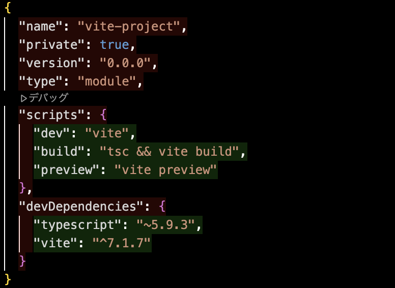

### Vite のセットアップ

- npm コマンドにて Vite プロジェクトの生成

    ```bash
    npm create vite@latest
    ```

    - ★npm create コマンドについては[こちら]()を参照

        - TODO: npm createコマンドの解説ページのリンクを貼る

<br>

#### vite コマンド

- Vite プロジェクト生成直後の package.json の scripts は以下の通り

    

    <br>

    - vite
    
        - 開発サーバーを起動するコマンド
    
    <br>

    - vite build

        - プロダクション向けのビルドコマンド

            - プロジェクトの index.html を起点として、JavaScript、CSS、画像などをまとめて **最小化（minify）やツリーシェイキング（不要なコードの削除）** を行い、(デフォルト) dist/ ディレクトリに出力するコマンド

    <br>

    - vite preview

        - vite build で生成された dist/ フォルダを使って、ローカルサーバーを立ち上げるコマンド

            - vite preview の前に vite build を実行しておく必要がある

        - 本番環境と同じような挙動になるので、開発中にビルド後の挙動をテストしたいときに使う

<br>
<br>

参考サイト

[Vite はじめに](https://ja.vite.dev/guide/)

[Vite コマンドラインインターフェイス](https://ja.vite.dev/guide/cli.html)
