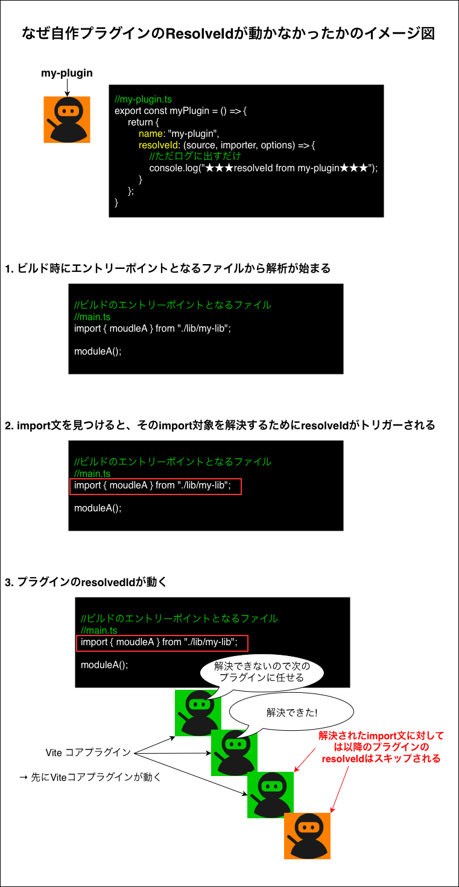

### 事象

- 自作プラグインで、resolveIdを実装したが、トリガーされない

    ```ts
    //my-plugin.ts
    export const myPlugin = () => {
        return {
            name: "my-plugin",
            resolveId: (source, importer, options) => {
                //ただログに出すだけ
                console.log("★★★resolveId from my-plugin★★★");
            }
        };
    }
    ```

    ```js
    //vite.config.js
    /** @type {import('vite').UserConfig} */
    import { myPlugin } from "./plugins/my-plugin";

    export default {
        plugins: [
            myPlugin()
        ]
    };
    ```

    <br>

    ↓ビルド時のログ

    

---

### 原因

- Vite コアプラグインで import 文の解決がされてしまい、自作プラグインまで回ってこない

    

<br>

- ★Vite コアプラグインは以下の import は解決してしまうので、以下の import 文に対しては自作のプラグインの resolveId が呼ばれなかった

    - bare import (パッケージ名だけを指定する import)

    - 相対パス / 絶対パス import

    - Vite　にビルトインで提供されている仮想モジュールの import

    - エイリアスを使った import

    - CSS や JSON などの import

    <br>

    

<br>
<br>

参考サイト

[resolveId is not called for imports #1899](https://github.com/vitejs/vite/issues/1899)

[Vite - プラグインの順序](https://ja.vite.dev/guide/api-plugin#plugin-ordering)

---

### 解決方法

- 自作プラグインの実行優先度 (enforce) をコアプラグインよりも高くする ("pre")

    ```ts
    //my-plugin.ts
    export const myPlugin = () => {
        return {
            name: "my-plugin",
            resolveId: (source, importer, options) => {
                //ただログに出すだけ
                console.log("★★★resolveId from my-plugin★★★");
            },
            enforce: "pre" //★★★ここ★★★
        };
    }
    ```