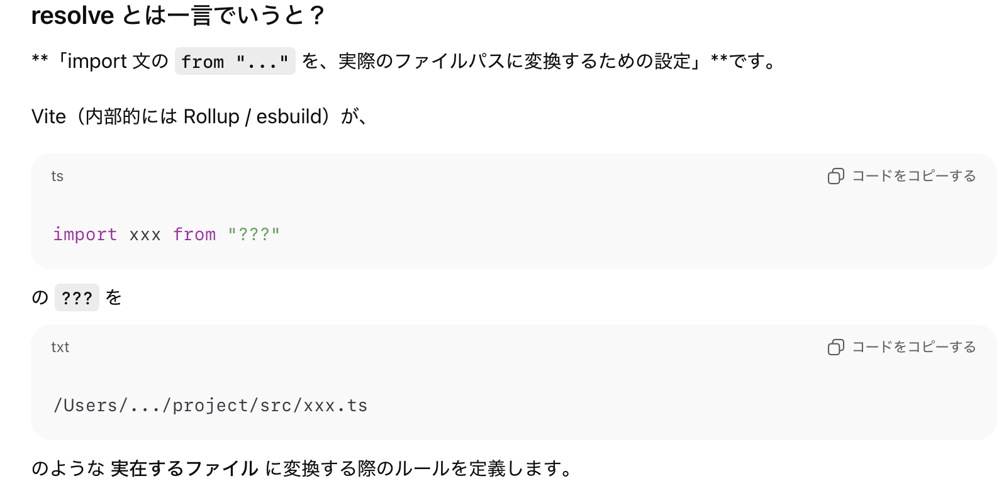

### viteconfig の resolve フィールド

 

- 特に tsconfig.json の [baseUrl](https://github.com/MasaGt/TypeScript/blob/3df67a4cba3dbd099c52243750b0830db5c513af/tsconfig_baseUrl.md), [paths](https://github.com/MasaGt/TypeScript/blob/3df67a4cba3dbd099c52243750b0830db5c513af/tsconfig_paths.md) フィールドと整合性を取るために利用されるフィールド

    →vite ではビルドに esbuild (開発ビルド) / rollup (本番ビルド) を使うので、 tsconfig の設定は ビルドに関係ないため tsconfig の設定に従ったコードをうまくコンパイルするために、vite.config.ts (js) で整合性を取る必要がある

 

- vite.config.ts (js) で設定する resolve は複数の項目がある

    

---

### resolve.alias

- tsconfig.json の baseUrl / paths のように、 import 文中の エイリアスを定義する項目

    

 

- ★resolve.alias でエイリアスにマッピングするパスは**絶対パス**である必要がある

    

 
 

- ★★tsconfig.json で baseUrl や paths を設定していて Vite 側で整合性を取ろうとする場合、同じ内容を resolve.alias にかか開ければいけなかったが、[resolve.tsconfigPaths](#resolvetsconfigpaths) が登場してからは、そちらを設定した方が簡単

 

参考サイト

[Vite - resolve.alias](https://ja.vite.dev/config/shared-options#resolve-alias)

---

### resolve.tsconfigPaths

- tsconfig.json で設定した baseUrl, paths を Vite 側にも反映するかどうかの設定項目

    

 
 

参考サイト

[Vite - resolve.tsconfigPaths](https://ja.vite.dev/config/shared-options#resolve-tsconfigpaths)

---

### resolve.extensions

- 拡張子を省略したインポートに試行するファイル拡張子のリストを指定する項目

- デフォルト: `['.mjs', '.js', '.mts', '.ts', '.jsx', '.tsx', '.json']`

    

 
 

参考サイト

[Vite - resolve.extensions](https://ja.vite.dev/config/shared-options#resolve-extensions)

---

### resolve.dedupe

- resolve.dedupe で指定したパッケージは **常に「ルートの node_modules/react」から解決される**

    = そのパッケージがどこから import されようとも、常に同一の解決結果になる

    

 
 

参考サイト

[Vite - resolve.dedupe](https://ja.vite.dev/config/shared-options#resolve-dedupe)

---

### resolve.mainFields

 
 

参考サイト

[Vite - resolve.mianFields](https://ja.vite.dev/config/shared-options#resolve-mainfields)

---

### resolve.conditions

- [resolve.mainFields](#resolvemainfields) に非常に似ている設定項目

    - [package.json の exports フィールド](https://github.com/MasaGt/Node.js/blob/05544ff0da8f4d728b6c04e5f2944955871b69a6/package-json%E3%81%AEimports%E3%81%A8exports.md#packagejson-%E3%81%AE-exports-%E3%83%95%E3%82%A3%E3%83%BC%E3%83%AB%E3%83%89) のうちどのエントリーポイントのファイルを優先して読み込むかを指定する項目

    

 
 

参考サイト

[Vite - resolve.conditions](https://ja.vite.dev/config/shared-options#resolve-conditions)

---

### resolve.preserveSymlinks

- import 文の対象パッケージがシンボリックリンクの場合に、実体のパスまで辿るかどうかの設定項目

    

 

- `resovlve.preserveSymlinks: false` がデフォルト

 

- `resovlve.preserveSymlinks: false` にしても、モジュール解決時のみ実体パスまで辿るだけであり、**import 文中の対象のモジュールのパスは書き換えない**

 

- `resovlve.preserveSymlinks: true` にすると問題が生じるケースもあるらしい

    

 
 

参考サイト

[Vite - resolve.preserveSymlinks](https://ja.vite.dev/config/shared-options#resolve-preservesymlinks)